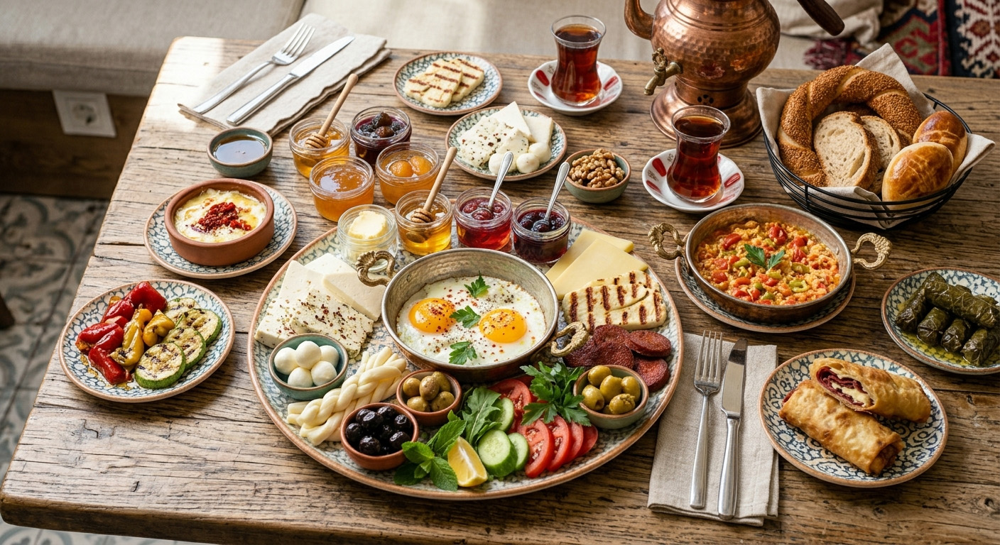

# GÖNCÜ MENU PRO - Wens Viento Dijital Menü

Premium, mobil öncelikli, vanilla JavaScript tabanlı dijital QR menü sistemi.

## Özellikler

- Ürün popup sistemi
- Besin değerleri ve alerjen bilgileri
- Türkçe / İngilizce dil desteği
- Arama sistemi
- Favoriler
- Açık / koyu tema
- Mobil responsive yapı
- Lazy loading görseller
- Statik ve güvenli `images/` görsel yolu
- SEO meta etiketleri, manifest, sitemap ve robots dosyaları

## Görsel kuralı

Görseller runtime olarak tahmin edilmez. Her ürün görseli HTML içinde gerçek dosya yolu ile yazılır:

```html

```

Dosya hangi uzantıdaysa HTML içinde de aynı uzantı kullanılmalıdır.

## Yerel test

VS Code içinde projeyi klasör olarak açın ve Live Server ile çalıştırın.

```text
index.html > Open with Live Server
```

`nutrition.json` dosyası `fetch()` ile okunduğu için `index.html` dosyasını çift tıklayarak açmak tam test için önerilmez.

## Yayın

GitHub Pages için önerilen ayar:

```text
Settings > Pages > Deploy from a branch > main / root
```

Canlı URL:

```text
https://holydarknes.github.io/goncu-menu/
```
